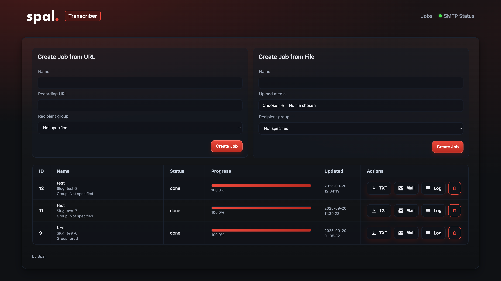

# Spal.Transcriber

A simple self-hosted transcription tool.  
It runs locally, so your audio/video never leaves your machine or server.

---

## Features

- Upload local files (`.mp4`, `.mp3`, `.wav`, …)
- Automatic transcription using [faster-whisper](https://github.com/guillaumekln/faster-whisper)
- Job queue with progress tracking
- Download transcripts as `.txt`
- Optional email delivery (SMTP, with group support)
- Recipient groups (e.g. `recipients_main.txt`, `recipients_team.txt`)
- Web interface with dark theme
- Basic authentication (via `.env`)
- Docker support

---

## Usage

1. Clone this repository  
2. Copy `.env.example` to `.env` and adjust settings  
3. Install Python requirements (or use Docker, see below)  

Run locally:

```bash
pip install -r requirements.txt
python app.py
```

Then open [http://localhost:15551](http://localhost:15551).

---

## Docker (compose)

For running in Docker, create a `.env` file with your settings (see `.env.example`).  
Then use Docker Compose:

```yaml
services:
  transcriber:
    image: spaleks/transcriber:latest
    # or if you prefer quay.io:
    # image: quay.io/spaleks/transcriber:latest
    container_name: spal-transcriber
    ports:
      - "15551:15551"
    volumes:
      - ./data:/app/data
      - ./config:/app/config
      - ./.env:/app/.env:ro
```

---

## Example workflow

1. Go to `http://localhost:15551`  
2. Upload a file (e.g. `meeting.mp4` or `recording.mp3`)  
3. Select which **recipient group** should be notified (if SMTP is configured)  
4. Wait until processing finishes  
5. Download the transcript or send it via email  

---

## Recipient groups

Recipients are defined in plain text files inside the `RECIPIENTS_DIR` (default: `./config`).  

- `recipients.txt` → main recipients (always notified if email sending is enabled)  
- `recipients_<group>.txt` → group-specific recipients (notified only if the job is assigned to that group)  

Example:

```text
config/
  recipients.txt           # always notified
  recipients_Team.txt      # group "Team"
  recipients_Clients.txt   # group "Clients"
```

Inside each file, list one email address per line. Lines starting with `#` are ignored.  

---

## Environment variables

Here’s what you can configure via `.env`:

### App
- `APP_DATA_DIR` – Directory for storing jobs and outputs (default: `./data`)  
- `APP_HOST` – Host to bind (default: `127.0.0.1`)  
- `PORT` – Port to bind (default: `15551`)  
- `APP_AUTH_USER` – Username for Basic Auth  
- `APP_AUTH_PASS` – Password for Basic Auth  

### Whisper
- `WHISPER_MODEL` – Model size (`tiny`, `base`, `small`, `medium`, `large-v3`)  
- `WHISPER_DEVICE` – `cpu` or `cuda`  
- `WHISPER_COMPUTE` – Compute type (`int8`, `float32`, `int8_float16`, `float16`)  
- `WHISPER_THREADS` – CPU threads (integer)  

### SMTP / Email
- `AUTO_SEND_EMAIL` – If `1`, emails are sent automatically after transcription (default: `0`)  
- `SMTP_HOST` – SMTP server hostname  
- `SMTP_PORT` – SMTP port (default: `587`)  
- `SMTP_USER` – SMTP username (optional)  
- `SMTP_PASS` – SMTP password (optional)  
- `SMTP_SENDER` – Sender email address  
- `SMTP_SENDER_NAME` – Display name for sender  
- `SMTP_USE_TLS` – Use STARTTLS (default: `1`)  
- `SMTP_USE_SSL` – Use SSL/TLS directly (default: `0`)  
- `SMTP_VERIFY` – Verify server certificate (`1` = yes, `0` = no)  

### Recipients
- `RECIPIENTS_DIR` – Directory containing recipient list files (default: `./config`)  
- `RECIPIENTS_FILE` – Path to main recipients file (default: `./config/recipients.txt`)  

### Mail template
- `MAIL_SUBJECT` – Email subject (supports `{name}`, `{slug}` placeholders)  
- `MAIL_BODY` – Email body (supports `{name}`, `{slug}`, supports `\n`)  
- `MAIL_BODY_FILE` – Optional path to a file containing email body  

---

## Privacy notice
- All files are stored and processed **locally**.  
- Nothing is uploaded to third-party servers.  
- Please always respect the privacy of speakers and only process content you are allowed to handle.  

---

## License
MIT

